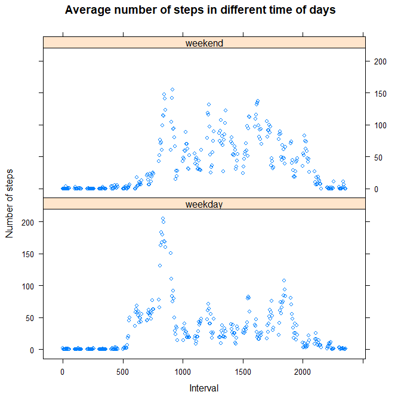

# Reproducible Research: Peer Assessment 1


## Loading and preprocessing the data


```r
unzip("activity.zip")
activity <- read.csv("activity.csv")
```


## What is mean total number of steps taken per day?

1. Calculate the total number of steps taken per day

2. Make a histogram of the total number of steps taken each day


```r
library(dplyr)

day_total <- activity %>% group_by(date) %>% summarise(total = sum(steps))

hist(day_total$total, xlab="Number of steps",
     main="Total number of steps taken each day")
```

<!-- -->

3. Calculate and report the mean and the median of the total number of steps taken each day

```r
mean(day_total$total, na.rm=TRUE); median(day_total$total, na.rm=TRUE)
```

```
## [1] 10766.19
```

```
## [1] 10765
```


## What is the average daily activity pattern?

1. Make a time series plot (i.e. type = "l") of the 5-minute interval (x-axis) and the average number of steps taken, averaged across all days (y-axis)

```r
time_avg <- activity %>% group_by(interval) %>% summarise(avg = mean(steps, na.rm=TRUE))
plot(time_avg, type="l", xlab="Interval", ylab="Number of steps",
     main="Average number of steps taken, averaged across all days")
```

<!-- -->

2. Which 5-minute interval, on average across all the days in the dataset, contains the maximum number of steps?

```r
time_avg$interval[which.max(time_avg$avg)]
```

```
## [1] 835
```


## Imputing missing values

1. Calculate and report the total number of missing values in the dataset (i.e. the total number of rows with NAs)

```r
sum(is.na(activity$steps))
```

```
## [1] 2304
```

2. Devise a strategy for filling in all of the missing values in the dataset. The strategy does not need to be sophisticated. For example, you could use the mean/median for that day, or the mean for that 5-minute interval, etc. **The strategy used here is: median for the corresponding 5-minute interval accross all days.**

```r
## Calculate the median for every 5-minute interval across the dates
time_median <- activity %>% group_by(interval) %>% summarise(median = median(steps, na.rm=TRUE))
```

3. Create a new dataset that is equal to the original dataset but with the missing data filled in.

```r
activity2 <- activity
for (i in 1:nrow(activity2)) {
        if (is.na(activity2$steps[i])) {
                # Find index of the corresponding 'interval' in the data.frame 'time_median'
                interval_index <- match(activity$interval[i], time_median$interval)
                activity2$steps[i] <- time_median$median[interval_index]
        }
}
```

4. Make a histogram of the total number of steps taken each day and Calculate and report the mean and median total number of steps taken per day. Do these values differ from the estimates from the first part of the assignment? What is the impact of imputing missing data on the estimates of the total daily number of steps?

```r
day_total2 <- activity2 %>% group_by(date) %>% summarise(total = sum(steps))
hist(day_total2$total, xlab="Number of steps",
     main="Total number of steps taken each day (revised)")
```

<!-- -->

These values differ from the estimates from the first part of the assignment.

Inputting missing data seems to make the daily number of steps lower.


## Are there differences in activity patterns between weekdays and weekends?

1. Create a new factor variable in the dataset with two levels - "weekday" and "weekend" indicating whether a given date is a weekday or weekend day.

```r
# Create a function that inputs a YYYY-MM-DD string and ouputs either "weekday" and "weekend"
# indicating whether a givend date is a weekday or weekend day.
date_type <- function(dateString) {
        date <- as.Date(dateString, "%Y-%m-%d")
        weekday <- weekdays(date)
        if (weekday %in% c("Saturday", "Sunday")) {
                return ("weekend")
        } else {
                return ("weekday")
        }
}

# Create a new factor variable 'dateType' in the dataset indicating whether a given date
# is a weekday or weekend day
activity2$dateType <- as.factor(sapply(activity2$date, date_type))
```

2. Make a panel plot containing a time series plot (i.e. type = "l") of the 5-minute interval (x-axis) and the average number of steps taken, averaged across all weekday days or weekend days (y-axis). See the README file in the GitHub repository to see an example of what this plot should look like using simulated data.

```r
# Create a new data frame to hold the data necessary for plotting
time_avg2 <- activity2 %>% group_by(interval, dateType) %>%
                summarise(avg = mean(steps))

# Plot
library(lattice)
xyplot(avg ~ interval | dateType, data=time_avg2, layout=c(1,2),
       xlab="Interval", ylab="Number of steps",
       main="Average number of steps in different time of days")
```

<!-- -->
